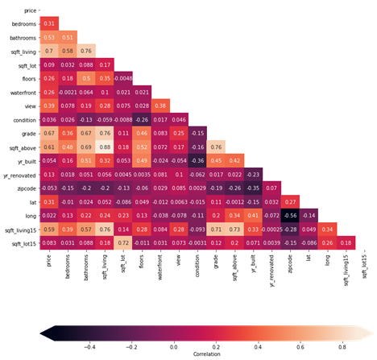
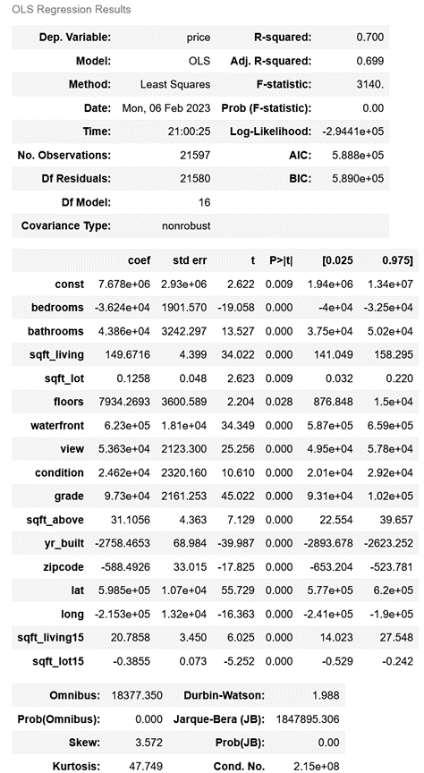
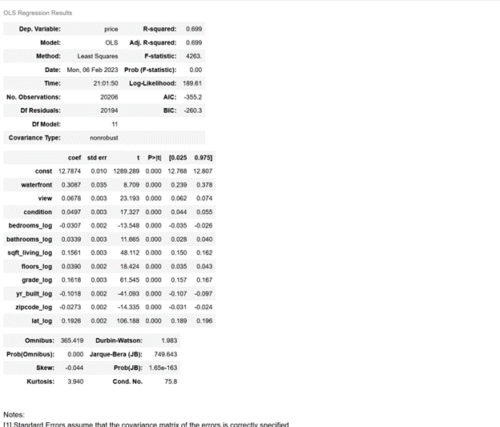
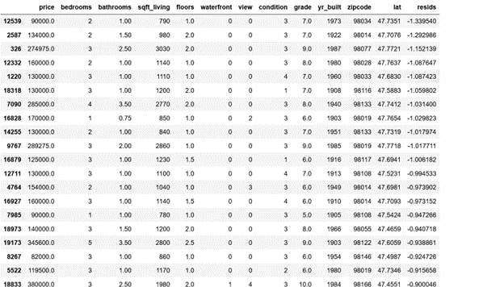

# king-housing

**Author:** Grant Edwards

## Overview

King Renovators is looking for a way to help find homes that are below market value that they can buy, remodel, and sell for a profit, as well as what home features can help increase the properties values. King county Washington, the home to Seattle, is one of the hottest housing markets in the country with a lot of potential for profits to be made in buying homes that are below market, remodeling and adding features that improve the value of the property and selling for a profit. However, King county has a large number of properties and it would be impossible for someone to, quickly and thoroughly find homes that have potential to be profitable by hand. This is where we can use historical data to help predict the homes values based on the features and find homes that have potential to be profitable.

***

## Business Problem

To achieve the companies goals we will be looking at historical data from home sales in King County to build a model to help us identify what features have the biggest impact on the price of a home, as well as what percentage of a home value can be predicted by the known features from our dataset. Then can we use our results to identify homes that have potential to be flipped for a profit.

- What features have the largest impact on the price of a home?
- Can we accurately predict the price of a home based on the known variables?
- Can we use our model to identify homes that are under their predicted market value?

We can do this by testing our hypothesis and checking relative to our null hypothesis

Hypothesis: The independent variables have an effect on the dependent variable of home price and can be used to estimate the sale price of the home.
Null Hypothesis: The independent variables have no correlation or statistical correlation to the dependent variable of home price and cannot be used to estimate the home price.

***

## Data

TThe data we will be using to accomplish this is historical home sales from King County. The data contains the sale price of the home, which will be our dependent variable. The features that we will be using as our independent variables are the number of bedrooms, bathrooms, floors, square footage of the home and the lot, and locational information such as if the property is waterfront, has a view, and where it is located (zip code, latitude and longitude). We will also be looking at variables that measure the condition of the house, as well as the grade (which measures the design and construction quality of the home).

Quick Description for the variables from our dataset:

id - a unique number to for the home (will not be used in our linear regression model).
Date - the date the home was sold.
Price - the sale price of the home.
Bedrooms - number of bedrooms in the home.
Bathrooms - number of bathrooms in the home. 
Sqft_living - square footage of the living space in the home
Floors - number of floors
Waterfront - whether the property was waterfront or not
View - the view from the house (measured categorically from none to excellent, 1-5).
Condition - the physical condition of the home and how well maintenance was upkept (on a scale of poor to very good, 1-5).
Grade - measure of the design and build quality of the home (1-13, short of minimum building standards to mansion).
Sqft_above - square footage above ground level.
Sqft_basement - square footage of basement.
Yr_built - the year the home was built.
Yr_renovated - the year the home was renovated or remodeled.
Zipcode - the zipcode of the home.
Lat - the latitude of the home.
Long - the longitude of the home. 
Sqft_living15 - the square footage of the home of the 15 nearest neighbors.
Sqft_lot15 - the square footage of the lot of the 15 nearest neighbors. 

***

## Methods

We started by getting the needed data from our dataframe and making sure there are no missing values and making sure the data that we will be using will be usable for linear regression models. We then can remove a few of the variables that will not be needed for our model such as ‘id’ which just identifies the homes, and should have no effect on our model. We then can then run independent variables through a linear regression model, compare to the price (our dependant variable) to find how much of an effect they have on the outcome of the price. We then can work with our model, removing nonsignificant variables that fail to dismiss the null hypothesis (that there is no significant correlation between the variable and price.) We go further to make sure the data we are using is linear, increasing in price consistently as the independent variable increases, normality (that our values are consistent and a normal bell curve, and the data is homoscedastic and not heteroscedastic. 

Heatmap to see correlation between variables


Initial Model


***

## Results

From the final model we can find answers to our question on what are the most import features for predicting the price of a home, can we accurately predict the price of a home and can we use our model to find homes that are below market value. 

Final Model


By looking at are t-values, we can find our most significant features are the latitude, the square footage and the grade of the home. The latitude for the property cannot be changed as it is dependent on the location of the home, but with this we can learn that the further north we go into King County, the higher the property value. The grade and the square footage of the home can potentially improve with a remodel. We can also use these variables to begin to identify homes that are potentially being sold under market value. 

We can also find through our R-squared value that 69.9% of home values can be attributed to our independent variables. From our current variables we should be able to get a decent prediction on the market value of a home. There are other factors that will contribute to the value of the home, such as the neighborhood, school districts, garage and off street parking, and features on the lot such as mature trees, decks or pools.

Looking at the residuals for our models, we can get a quick view of homes that are on the market for below their predicted values. This could be used to help identify potential properties that are below market value or if there is some variable that can be improved to help increase the homes value. We can do this by looking for residuals with the larger negative values. 

***

## Conclusions



In the above table we are looking at the 20 homes with the highest negative residual values. These homes are well below their predicted values. These homes should have potential for good investment opportunities. Using the independent variables with the strongest affect on our model (latitude, grade, and square foot of living space), we can identify a few homes that would be worth looking into to as potential investments.

Using a linear regression model we can get a decent idea on what the value of a home should be, found the most significant variables affecting the homes value, and help identify homes with high potential to make a profit from. This model can be used to reduce seaching time and quickly identify the highest potential investment properties.

Potential issues include potential missing or incorrect data, as well as features that were not included in our dataset such as outdoor spaces, landscaping features and garage space. 
***

## For More Information

Please review our full analysis in [our Jupyter Notebook](./index.ipynb) or our [presentation](./King-Housing-Presentation.pdf).

For any additional questions, please contact **Grant Edwards, grantedwards11@gmail.com**

***

## Repository Structure


```
├── README.md                           <- For reviewers of this project
├── index.ipynb                         <- Narrative documentation of analysis in Jupyter notebook
├── micro_movie_presentation.pdf        <- PDF version of project presentation
├── data                                <- Sourced externally from historical home sales in King County
└── Images                              <- Generated from code
```
